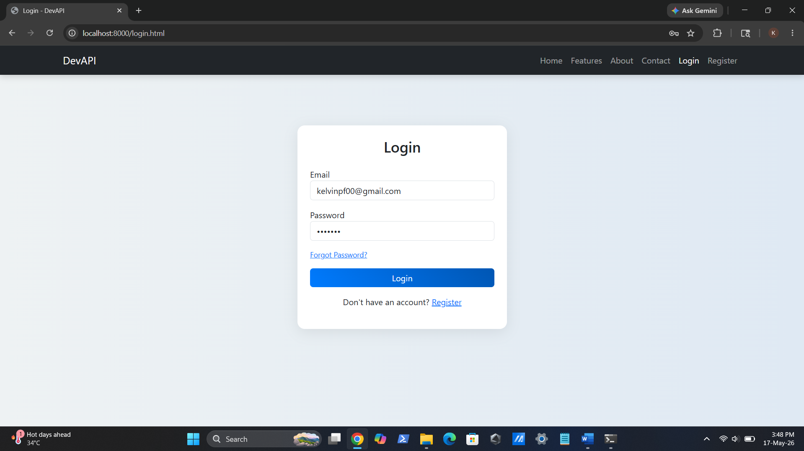
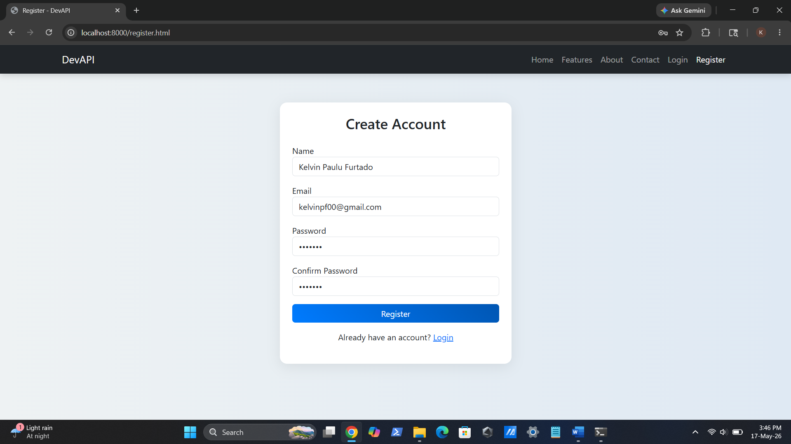
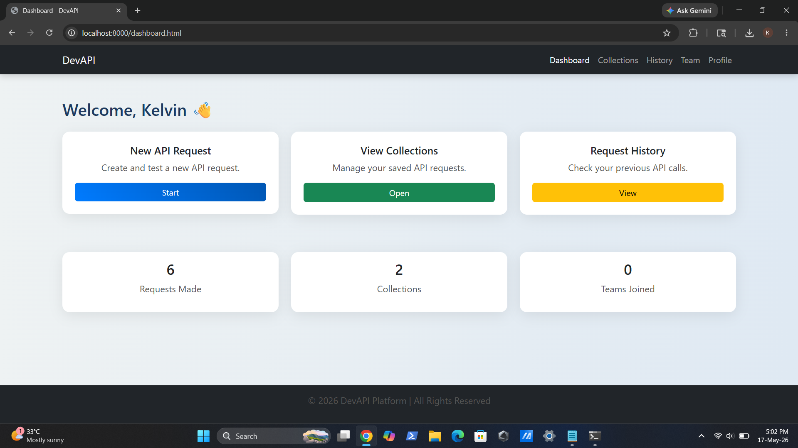
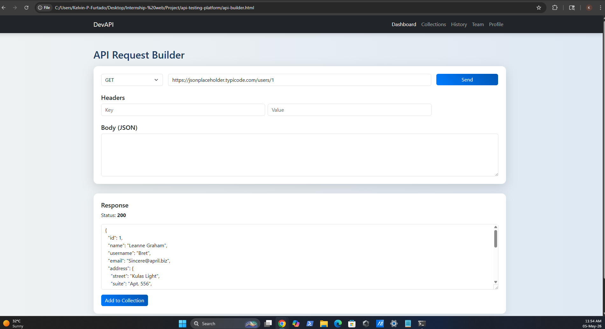
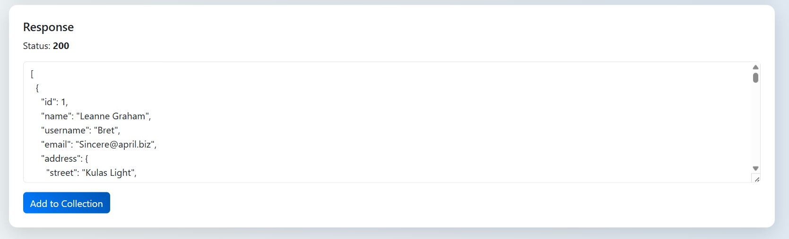
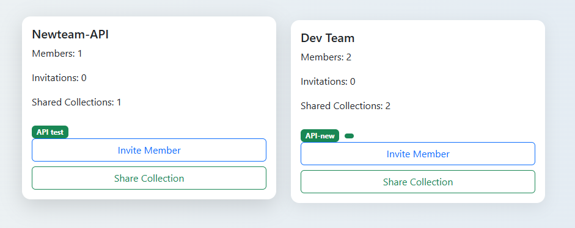
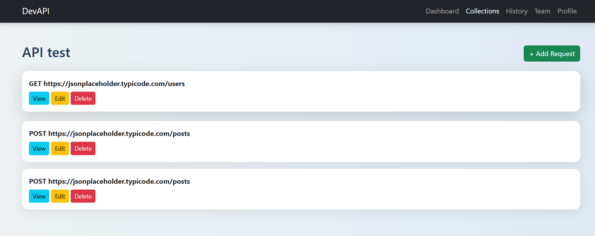
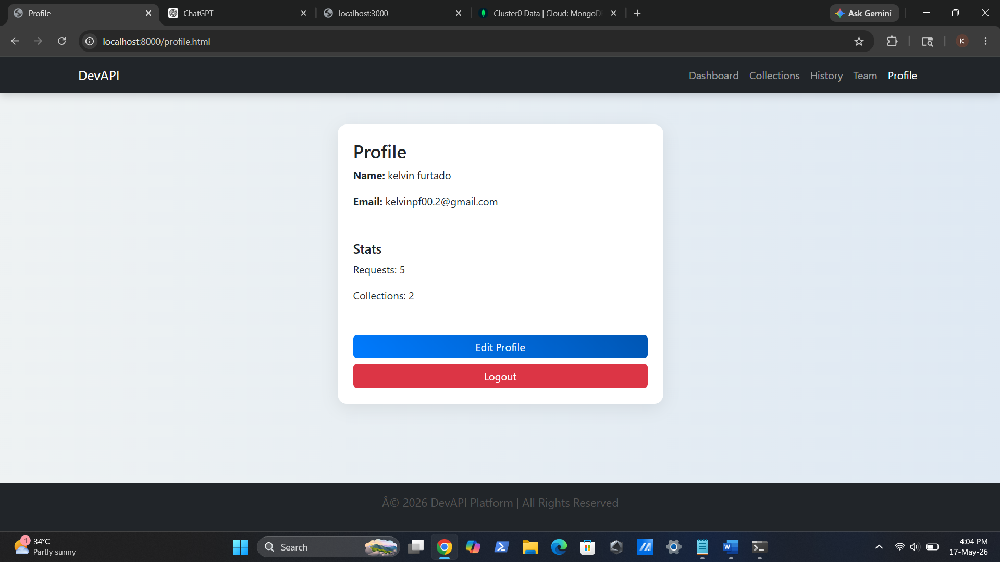
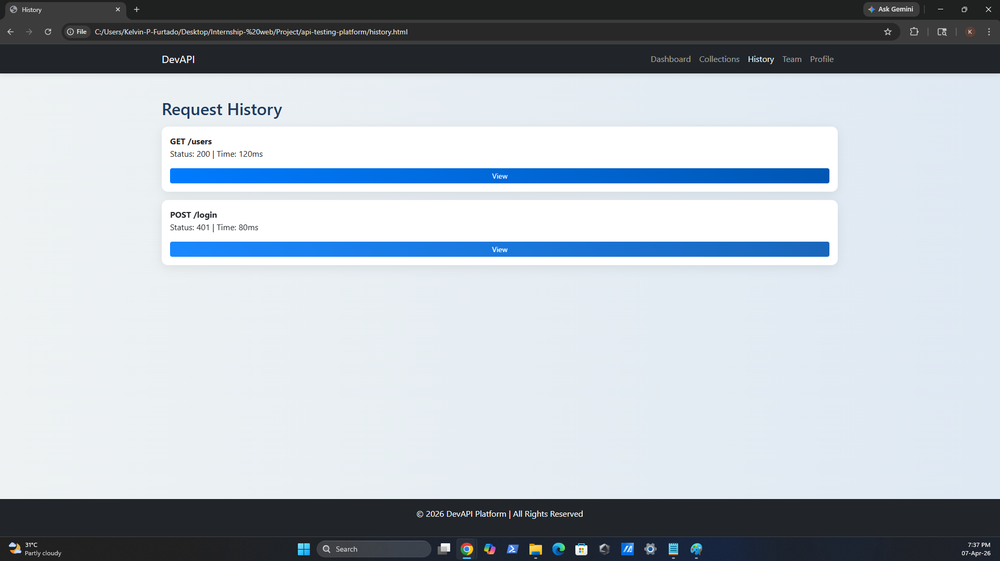

# DevAPI

DevAPI is a web-based API testing and collaboration platform inspired by Postman. It enables users to create, organize, and test API requests through a user-friendly interface while supporting collaboration-oriented workflows.

## Features

- Create and manage API requests
- Organize requests into collections
- View request history
- Team collaboration functionality
- User authentication and profile management
- Responsive web interface

## Technologies Used

### Frontend
- HTML
- CSS
- JavaScript

### Backend
- Node.js
- Express.js

### Database
- MongoDB Atlas

## Project Structure

```text
backend/
css/
index.html
login.html
register.html
collections.html
request-details.html
profile.html
team.html
```

## Project Purpose

This project was developed during my internship to gain hands-on experience in:

- API workflows
- Full-stack web development
- Database integration
- User authentication
- Team collaboration systems

## Screenshots

### Login Page


### Registration Page


### Dashboard


### API Request Builder


### API Response


### Collections


### Collection Details


### Profile


### Request History


## Repository Structure

```text
backend/
├── models/
│   ├── Collection.js
│   ├── History.js
│   ├── Team.js
│   └── User.js

css/
└── style.css

screenshots/

Frontend Pages:
- index.html
- login.html
- register.html
- profile.html
- collections.html
- request-details.html
- team.html
```

## Author

Kelvin Furtado

- LinkedIn: www.linkedin.com/in/kelvin-furtado-67bb5a247
- GitHub: www.github.com/Kelvinpfurtado
